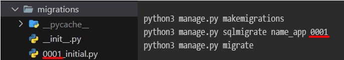
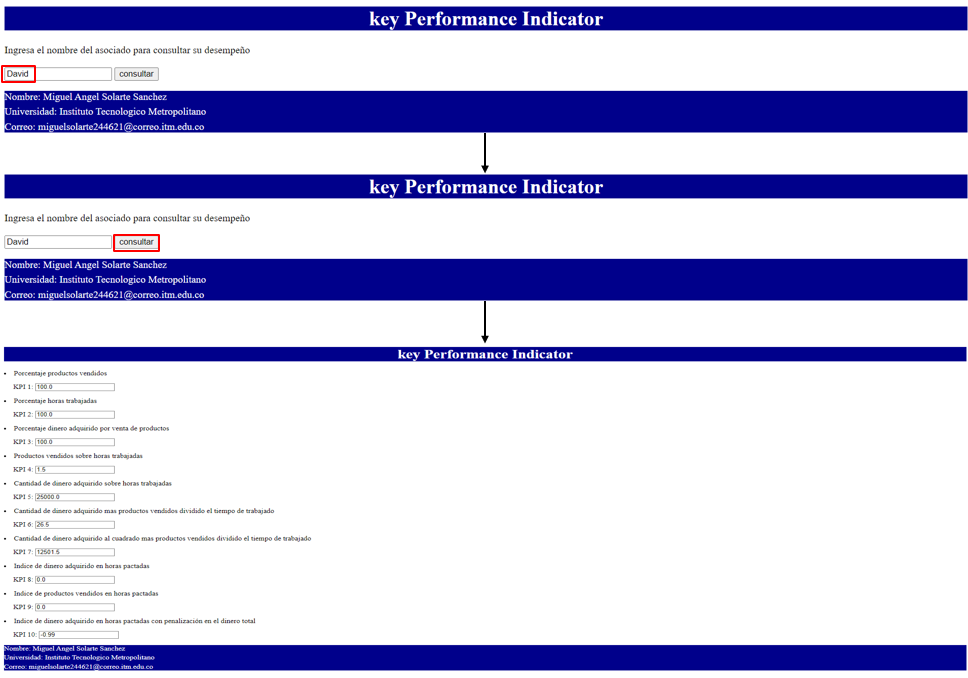

# Indice

1. [Descripción del programa](#1-descripción-del-programa)
2. [Instalación](#2-instalación)
3. [Configuración](#3-configuración)
4. [Modo de uso](#4-modo-de-uso)

# 1. Descripción del programa

El programa evalúa el desempeño de los vendedores de una tienda, registrando la información en una base de datos. Esta base de datos contiene datos como el nombre del vendedor, las horas trabajadas a la semana, los productos vendidos y el dinero total. A partir de esta información, se realizan diez mediciones de desempeño para el vendedor consultado.

# 2. Instalación

```
git clone
python3 -m venv env
source env/bin/activate
pip3 install -r requirements.txt
```

# 3. Configuración 

Una vez realizada la instalación se debe realizar la configuración del programa realizando los pasos a continuación.

1. Abra la terminal y vaya a la ubicación del directorio donde hizo la instalación.

2. Escriba en consola el comando:

    ```
    cd taller_2
    ```

3. Digite los siguientes comandos:

    ```
    python3 manage.py makemigrations
    python3 manage.py sqlmigrate name_app 0001
    python3 manage.py migrate 
    ```

   Nota: asegúrese de que el valor del segundo comando coincida con el valor del nombre del archivo .py ubicado en la carpeta migrations.

   

4. Para ingresar información a la base de datos siga la siguiente instrucción:

    ```
    python3 manage.py shell

    from KPI.models import Asociados
    p1 = Asociados(nombre='David', hr_trab=5, can_prod_ven=15, can_din_total=100000)
    p1.save()
    ```

   Los parámetros hacen referencia a:
   - `nombre`: nombre del vendedor.
   - `hr_trab`: horas trabajadas.
   - `can_prod_ven`: cantidad de productos vendidos.
   - `can_din_total`: cantidad de dinero adquirido por venta de productos.

# 4. Modo de uso

Una vez realizada la configuración, ejecute el comando `python3 manage.py runserver` y luego en su navegador vaya al servidor `http://127.0.0.1:8000/`. Si todo está correcto, debería aparecer la siguiente interfaz:


Si ingresa el nombre del vendedor y este se encuentra en la base de datos, al oprimir el botón "consultar" se dirigirá a una interfaz donde se muestra los KPI que evalúan el desempeño del vendedor [imagen interfaz 2](images/interfaz_2.png).


